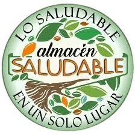
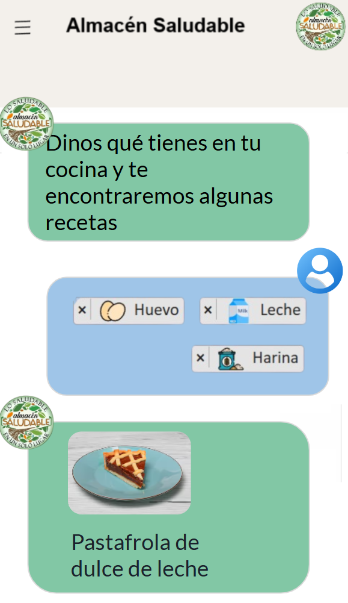
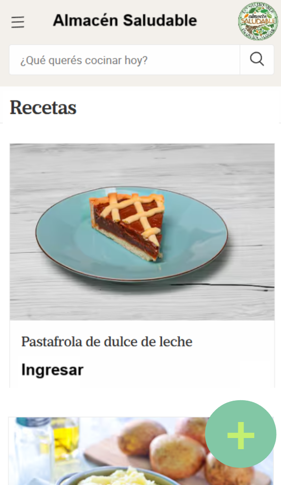

# Proyecto de Almacen

El fin de este proyecto es armar un sistema de recomendación de recetas inteligente y sencillo, que permita al cliente captar nuevo publico. Para ello se utilizan las siguientes tecnologías:
- Inteligencia artificial utilizando machine learning
- Frontend con React JS
- Backend con Flask

### Sobre el cliente
"Almacen saludable" es una empresa que vende y distribuye insumos alimenticios a pequeños clientes (familias) y negocios en San Luis (Argentina). Este negocio busca capturar más publico utilizando nuevas tecnologías que le permitan brindar más popularidad a la marca, y sumar otros canales de venta alternativos.

### Objetivo
Lo que se busca es un sistema de recomendación de recetas y comidas, utilizando una interfaz al estilo "chat" el cual un bot con inteligencia artificial recomendará una comida al usuario en base a los ingredientes que este posea en su casa (y recomendándole cuales otros ingredientes debe comprar/adquirir para armar la receta).
- El sistema se realizará con un datasets de recetas de comidas Argentinas los cuales los miembros del equipo de data deberán analizar, limpiar y procesar para entrenar un modelo de inteligencia artificial. El dataset no contiene todos los ingredientes sino solo los esenciales a fin de mantenerlo sencillo.
- La aplicación se realizará en React, el cual tendrá 4 pantallas (ver las imagenes de ejemplo de esta carpeta):
 - Una pantalla al estilo chat el cual el usuario indicará que ingredientes tiene disponible y el sistema en base a eso responderá que receta posible puede lleva a acabo el usuario y que otros ingredientes necesita para elaborarla más allá de los indicados por el usuario. Puede utilizar esta página como referencia:\
[Referencia 1](https://www.gptcuisine.com/?lang=es_ES&lang=es_ES&gad_source=1&gclid=Cj0KCQiA88a5BhDPARIsAFj595hBdIIF4pQhvCELuA2feM5tXOLilaqIddDiwZ5h5qclW2-_tzmTWOEaAqYNEALw_wcB)
 - Una pantalla con todo el catálogo de recetas posibles, en dónde el usuario puede buscar una receta por su nombre.
 [Referencia 2](https://foodit.lanacion.com.ar/recetas/)
 - Una página dónde se muestra el detalle de la receta (el nombre, los ingredientes, etc) al cual se ingresa cuando el usuario hace click en una receta en el chat o en el catálogo.
 - Una página para agregar una nueva receta, ingresando nombre e ingredientes necesarios.

### Modelo de data
El dataset que se provee en esta carpeta (recetas.csv) fue generado en base a diversas páginas de recetas disponibles en la web. Este dataset tiene 3 columnas:
- Nombre: Nombre de la receta, es un dato más que nada para el frontend (no es importante para el entrenamiento del modelo)
- Ingredientes: Una lista de ingredientes separados por guión, son los ingredientes más importantes de la receta.
- Categoría: Si la receta es del desayuno, almuerzo, cena o postre.

Para entrenar el modelo deberá realizar un procesamiento de datos eliminando recetas repetidas en caso de que existieran, y armar un CSV (una tabla) en la cual por cada ingrediente se utilice una columna (onehot encoding) --> Es decir que si entre todas sus recetas del dataset existen 20 ingredientes distintos, su dataset tendrá 20 columnas de ingredientes.\
Podrá entrenar dos modelos de inteligencia artificial con estos datos:\
1) El modelo principal el cual recibe una lista de ingredientes y en base a eso el modelo recomienda la receta más cercana posible a relaizar con ellos. Para esto deberá utilizar un modelo de segmentación, o un modelo de vecinos cercanos o un cálculo/herramienta de medición que permita encontrar la receta "más próxima" a los ingredientes enumerados por el usuario. Para este modelo/procedimiento no se debe utilizar la columna categoría.\
2) Otro modelo posible a realizar (secundario) es que en base a los ingredientes que el usuario ingrese a crear una nueva receta el modelo le indique al usuario en que categória pertenece esa receta (desayuno, almuerzo, cena o postre) Para esto deberá utilizar la columna de categória y los ingredientes para armar un modelo de clasificación.

### Despliegue del proyecto
- El proyecto de frontend deberá desplegarse en netlify o github pages o cualquier otra plataforma, cada vez que el equipo de backend necesite ver o utilizar el mismo.
- El proyecto de backend deberá desplegarse en python anywhere o cualquier otra plataforma, cada vez que el equipo de frontend necesite ver o utilizar el mismo.

### Épicas por rol

Alumno/a Frontend 1
- Definir junto a su compañero/a de frontend como se estructurará el proyecto y los componentes del mismo.
- Armar la estructura de aplicación de React con Vite y colocarla a disposición en el reposotorio en la carpeta "frontend".
- Armar la página de chat de recomendación de recetas y todos sus componentes. Se deberá poner de acuerdo con su compañero/a que componentes de react son compartidos y quien diseña cada uno de esos elementos compartidos (botones, campos de entrada, etc). Tener en cuenta que el usuario podrá elegir ingredientes de una lista posible, no cualquier ingrediente existente en el mundo (esto lo define el equipo de backend).
- Armar la página del detalle de una receta y todos sus componentes. Se deberá poner de acuerdo con su compañero/a que componentes de react son compartidos y quien diseña cada uno de esos elementos compartidos (botones, campos de entrada, etc)
- En cada caso implementar el manejo de APIs para la páginas que ha desarrollado, poniendose de acuerdo con su compañero/a en como llevarlo a cabo y contruir los componentes en común.

__NOTA:__: Comenzar armando las páginas con datos inventados hasta que el frontend pueda consumir los datos reales del backend.

Alumno/a Frontend 2
- Definir junto a su compañero/a de frontend como se estructurará el proyecto y los componentes del mismo.
- Crear la paleta de colores en base a los ejemplos de pantalla y armar el diseño a grandes rasgos de las dos pantallas restantes en algún programa de diseño (Figma, Paint, etc)
- Armar la página de catálogo de recetas y todos sus componentes. Se deberá poner de acuerdo con su compañero/a que componentes de react son compartidos y quien diseña cada uno de esos elementos compartidos (botones, campos de entrada, etc)
- Armar la página para dar de alta (agregar) una nueva receta. Se deberá poner de acuerdo con su compañero/a que componentes de react son compartidos y quien diseña cada uno de esos elementos compartidos (botones, campos de entrada, etc).
- En cada caso implementar el manejo de APIs para la páginas que ha desarrollado, poniendose de acuerdo con su compañero/a en como llevarlo a cabo y contruir los componentes en común.

__NOTA:__: Comenzar armando las páginas con datos inventados hasta que el frontend pueda consumir los datos reales del backend.

Alumno/a Backend 1
- Definir junto a su compañero/a de backend como se estructurará el proyecto y los componentes del mismo.
- Estudiar junto a su compañero/a el dataset provisto y diseñar juntos el esquema de base de datos que utilizará luego el frontend (la base de dato para almacenar las recetas y los ingredientes de cada una)
- Crear la carpeta "analytics" e implementar la limpieza de datos acordada en el punto anterior armando así el dataset que se utilizará luego.
- Crear un sistema, implementar un método o entrenar un modelo o utilizar una herramienta de machine larning que le permita recomendar a un usuario una receta en base a los ingredientes que este haya seleccionado (la receta cuyos ingredientes más se acerquen a los seleccionandos, pudiendo faltar ingredientes)
- Exportar el modelo entrenado e importarlo en el proyecto de Flask, creando un endpoint para que el frontend pueda realizar la consulta y utilizar el modelo. Deberá llega a un acuerdo de que datos debe enviar el frontend y como para interarctuar con su endpoint.
- Armar un endpoint que permita al frontend consultar todas las recetas que tengan una cierta palabra en el nombre de ella (para la búsqueda por catálogo). Ejemplo si el frontend envía la palabra "milanesa" el backend deberá retornar una lista de JSON con todas las recetas que tienen en su título la palabra "milanesa".

Alumno/a Backend 2
- Definir junto a su compañero/a de backend como se estructurará el proyecto y los componentes del mismo.
- Estudiar junto a su compañero/a el dataset provisto y diseñar juntos el esquema de base de datos que utilizará luego el frontend (la base de dato para almacenar las recetas y los ingredientes de cada una)
- Crear la carpeta "backend" e implementar el proyecto en Flask que se utilizará para el backend y la base de datos del mismo con SQLAlchemy acordada en el punto anterior (los endpoints para cada página serán implementados luego)
- Crear un sistema, implementar un método o entrenar un modelo o utilizar una herramienta de machine larning que le permita clasificar la categoría de una nueva receta ingresada según los ingredientes aportados.
- Exportar el modelo entrenado e importarlo en el proyecto de Flask, creando un endpoint para que el frontend pueda realizar la consulta y utilizar el modelo. Deberá llega a un acuerdo de que datos debe enviar el frontend y como para interarctuar con su endpoint. Este endpoint será el que se invoque cuando el frontend envie los datos para crear una nueva receta, ademas usted deberá almacenar la receta en la base de datos con la categoría clasificada.
- Armar un endpoint que permita el frontend buscar los detalles de una receta ingresando el "ID" de la receta (código único generado en la base de datos que el backend compartió al frontend en la recomendación de receta o en el catálogo).
